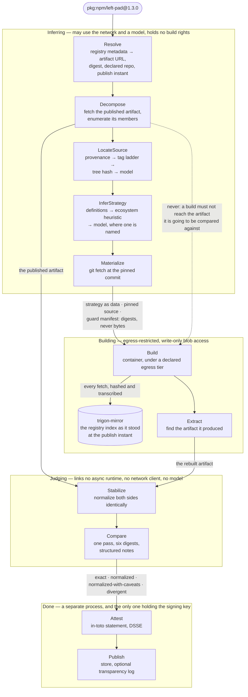

# Trigon

**Semantic rebuild verification for open-source packages.**

Trigon takes a published package artifact, finds the source it claims to come from, rebuilds it in a
controlled environment, and decides whether the rebuild and the published artifact are the same
thing. It signs a statement either way, and that statement is checkable by someone who does not
trust us.

Registries distribute artifacts. People audit source. Almost nothing checks that the two correspond,
and that gap is where build-time supply-chain attacks live.

**Today it rebuilds npm, PyPI, crates.io and NuGet packages.** RubyGems and GitHub releases are
designed for and sequenced next; a target in one of those is refused by name rather than attempted.
Comparing two artifacts you already have — the judgement half, below — needs no network and has no
prerequisites at all. Wheels, gems, crates and `.nupkg` files each get their own normalization. An npm
tarball does not — nothing inside a `.tgz` says whose it is — so it takes the generic tar+gzip set
unless `verify` or `stabilize` is given `--profile npm-tarball`, which is why the left-pad run below
reports `tar-gzip`.

**Using it?** [`docs/using-trigon.md`](docs/using-trigon.md) is the task-oriented guide: install,
compare two artifacts, rebuild a package, read a verdict, and — the section worth reading first —
what a verdict does *not* tell you.

## Status

M0, M1 and M2 are complete, and M3 has begun. The design lives in
[`docs/`](docs/) and was written before any code; [`docs/16-findings.md`](docs/16-findings.md)
records where building it proved the design wrong.

| Milestone | | |
|---|---|---|
| **M0** the judgement half | done | differential against the reference implementation: 34 match, 24 deviate by a declared entry, **0 unexplained** |
| **M1** first rebuilds | done | npm and PyPI rebuild end to end, under an enforced egress tier, against a time-filtered index |
| **M2** attestations | done | signed statements, re-derivable cross-machine and through an archived stabilizer set run under `wasmtime`; published to a Rekor transparency log and verified offline against it |
| **M3** the search half | begun | the deterministic parts first — failure signatures, log compression, the repair-loop policy, the Builder |

Tier-1 observability landed early, out of milestone order: every run at an enforced egress tier now
records a **network transcript** of everything that crossed into the build, and `attestable` is
derived from whether that account is complete rather than being a constant. The mirror had been
computing all of it — it hashes every body as it streams past, which is how the artifact guard works
— and throwing it away unless the hash matched.

Measured on the **M1 common-path corpus** — 197 npm and 200 PyPI targets, stratified by build
system rather than by popularity — at `--egress mirror-only`, the tier this README recommends, where
the build's only route out is a time-filtered mirror that writes down everything it serves:

| | reproduce | reach a comparison |
|---|---|---|
| npm | **100 of 132 (76%)** | 132 of 197 (67%) |
| PyPI | **136 of 163 (83%)** | 163 of 200 (81%) |

**crates.io and NuGet have no rate here, because they have no corpus yet.** Both rebuild end to end
at `mirror-only`, but neither has a stratified corpus, and a number quoted over targets picked by
hand is not a rate. What is known: of twelve crates tried, six reproduce — `hashbrown@0.17.1` and
`serde@1.0.219` among them, lockfile included — and every remaining divergence is the `Cargo.toml`
manifest rewrite that [`17-backlog.md`](docs/17-backlog.md) B20 is about.

The npm row folds in a six-target re-run rather than a second full sweep. npm 7.0 through 8.2
corrupts the tarballs it fetches concurrently — it presented as a broken mirror for months, and was
not — and it failed exactly the six targets pinning an npm in that window. Those six were re-run
after the fix; no other target in the corpus pins one, so nothing else could have moved.
[`16-findings.md`](docs/16-findings.md) §3.26 has the evidence.

**Quote the strata, not the aggregate.** Both totals above conceal a range wide enough to make them
useless on their own, which is the whole argument of [`15-corpora.md`](docs/15-corpora.md) §3:

| npm | compared | reproduced | | PyPI | compared | reproduced | |
|---|---:|---:|---|---|---:|---:|---|
| no lifecycle script | 74 of 90 | 65 | 88% | flit / hatchling | 47 of 50 | 47 | **100%** |
| `prepare`/`prepack` | 32 of 60 | 24 | 75% | setuptools + pyproject | 49 of 60 | 40 | 81% |
| TypeScript build | 23 of 30 | 10 | 43% | setuptools + `setup.py` | 30 of 40 | 18 | 60% |
| monorepo member | 3 of 17 | 1 | **33%** | poetry-core | 26 of 30 | 25 | 96% |
| | | | | maturin / C extension | 11 of 20 | 6 | **54%** |

npm's aggregate 76% spans 88% down to 33%; PyPI's 83% spans 100% down to 54%. **The reach is still
the worse number**: only 3 of 17 monorepo members get as far as a comparison at all, so the 33%
beside them is one of the three we could measure.

**Why this corpus and not an easier one.** Every figure before it came from the 37-target smoke
corpora, which are almost entirely one stratum — small utility packages with no build step — where
npm reproduces at 89% and PyPI at 88%. The common-path corpus adds TypeScript builds, monorepo
members, poetry projects and native extensions, and it exists to make the table above possible.

**Both ecosystems moved since the previous figures, and PyPI's rate fell for a good reason.** npm
was 84 of 115 (73%) reaching 115 of 197; PyPI was 119 of 136 (88%) reaching 136 of 200. npm improved
on both axes — the mirror now serves a lockfile-resolved tarball the index never offered, which
admitted a cluster that could not build at all, most of it TypeScript: that stratum went from 1 of 8
to 10 of 23. PyPI's *reach* rose from 68% to 81% and its *rate* fell from 88% to 83%, and the second
is a consequence of the first: twenty-seven more targets now reach a comparison and they are the
hard ones. A rate over a larger and harder denominator is lower and means more.

**Sixteen of npm's 65 non-compared targets are ours, not the packages'** — ten a missing tool
(3 × npx, 3 × pnpm, 3 × yarn, 1 × just), five a `workspace:` protocol npm does not speak, and one a
workspace sibling the recipe did not build first. A further fifteen are `Fault::Policy`: the
enforced tier doing what it was asked, mostly a host the build may not reach. Nineteen are the
package's own build, eleven produced no strategy at all, and four are upstream's.

Those first sixteen stay out of the reproduction rate by design — only `Fault::Build` says anything
about the package ([`02-domain-model.md`](docs/02-domain-model.md) §4) — but they are inside the
*reach* figure, which should therefore be read as a floor.

The six that were a mirror handing the build a body it could not read are gone from this list: that
was npm corrupting its own concurrent fetches, and those targets now reach a comparison. The three
npx failures have been fixed since the sweep and are still counted above, because they have not been
re-run.

What stops a target reaching a comparison is mostly named rather than mysterious — a base image
missing a tool, a package whose install fetches from a forge, a monorepo member we build outside its
workspace. [`16-findings.md`](docs/16-findings.md) §3.25 has the breakdown and what each one costs.

PyPI was 5 of 15 that morning. The lift came from three deterministic fixes and no model at all;
[`docs/16-findings.md`](docs/16-findings.md) §2 has the arithmetic.

## What it does

```
$ trigon verify left-pad-1.3.0.tgz rebuilt/left-pad-1.3.0.tgz
✔ normalized

  format         tar+gzip
  stabilizer set tar-gzip (4598411b636d…)

               upstream           rebuild
  raw          870c0fe10962…      55b10c02dc3c…      ≠
  container    2bc27360d33b…      39d388af65d0…      ≠
  stabilized   f0a01941419d…      f0a01941419d…      =

  containers differ as well as the framing

  applied
    gzip-meta                metadata        1 entries
    tar-entry-order          structural     10 entries
    tar-mode                 metadata       10 entries
    tar-time                 metadata       10 entries

  members  10 identical, 0 differ, 0 upstream-only, 0 rebuild-only
```

npm published that tarball in 2018; the rebuild is from this morning. They differ in gzip framing,
in member order, and in file modes — and the `applied` list is exactly which stabilizer removed
which, with how many entries it touched. In nothing else do they differ, which is what the shared
`stabilized` digest says. Change one byte of `index.js` and the verdict is `divergent`, the member
is named, and the exit code is 1.

Three digests per side, not one, because "the same tar in different gzip framing" and "a different
tar" are different findings and a single digest cannot tell you which you have.

## How it works

One rebuild, end to end. The boxes are four of the five persisted states — `Queued` is the sweep
planner's and a single `trigon rebuild` never sits in it — and the labels on the arrows between them
are the only things that cross.



Two edges in that picture are load-bearing, and both are easy to lose in implementation.

**The dashed one never happens.** Judging reads both sides, so a build must be unable to reach the
published artifact at all — including through our own content-addressed store, whose digest travels
with every target and whose reads would never cross the egress proxy. Today that is enforced by
`Decompose` handing forward a set of hashes rather than bytes: the guard manifest names what the
build must not produce, and carries none of it. The fleet shape adds a second rule, a write-only
blob credential scoped to the one run, which [`01-architecture.md`](docs/01-architecture.md) §1
specifies and no code enforces yet.

**The mirror is the build's only route out.** At `--egress mirror-only` the container sits in a
network island whose one reachable host serves the registry index *as it stood at the publish
instant* — so a dependency resolved during the rebuild is the one the publisher would have got, not
today's. Everything it serves is hashed on the way past and written to a transcript the run keeps.

The design puts a fifth step, `Explain`, inside Judging, to describe a difference in words.
It is not built: `Phase` has no such variant, and the `--explain` flag that exists only raises a
print limit — it opens no socket and calls no model. When it arrives it will be advisory and unable
to change a verdict, because the verdict is the digest comparison, and that half links nothing.

**The four boxes are states, not processes.** On a fleet they are separate workers with different
credentials, which is the point of drawing them apart. On a laptop `trigon rebuild` runs the first
three in one process and `trigon attest` is the second command in
[`scripts/rebuild-and-attest.sh`](scripts/rebuild-and-attest.sh) — deliberately not one, so the
thing holding the key re-derives the verdict from stored bytes rather than being told it by the
process that just executed a package's build script.

## Verify a package end to end

Two real targets, start to finish. Both need `podman` and take a few minutes each, most of it
pulling the base image the first time.

### An npm package

```
$ trigon rebuild pkg:npm/left-pad@1.3.0 \
      --image docker.io/library/debian@sha256:88200866dfff7ea7f5cbcb6ec7c8a701889efe6fe859fe64d6990e4b07ea4171 \
      --work ./work --egress open --timewarp auto

  artifact   left-pad-1.3.0.tgz
  published  sha256 870c0fe1096223a5
  guarding   the artifact and 0 of its members (10 too small, too common, or also in the source)
  source     https://github.com/stevemao/left-pad @ ff8e7ba8b41228…
  strategy   Heuristic, commit found by RegistryCommit, confidence Certain

  mirror     69 index request(s), 1044 version(s) withheld across them

✔ normalized

  format         tar+gzip
  stabilizer set tar-gzip (4598411b636d…)

               upstream           rebuild
  raw          870c0fe10962…      0ebf94afb7c6…      ≠
  container    2bc27360d33b…      b7142014cce1…      ≠
  stabilized   f0a01941419d…      f0a01941419d…      =

  members  10 identical, 0 differ, 0 upstream-only, 0 rebuild-only
```

`normalized` rather than `exact`: the two tarballs differ in mtimes, file modes and member order,
all of which the stabilizers remove, and in nothing else.

Note the `rebuild` raw digest is not the one in the first example. That was a different run at a
different egress tier, and a fresh `npm pack` does not produce the same bytes twice. The
**stabilized** digest is `f0a01941419d…` in both, which is the entire point: the verdict is a
property of the package, not of the afternoon it was rebuilt on.

The `mirror` line is the evidence that the dependency index really was pinned to the publish date.
The count is across all 69 packuments the build fetched, not left-pad's own — left-pad has published
nothing since 2018, so none of its fifteen versions were withheld. The thousand-odd come from its
devDependency tree, where `fast-check` alone accounts for 198 versions that did not exist in April
2018, `core-js` for 180 and `glob` for 73.

### A PyPI package

```
$ trigon rebuild pkg:pypi/chardet@7.6.0 \
      --image docker.io/library/python@sha256:d50fb7611f86d04a3b0471b46d7557818d88983fc3136726336b2a4c657aa30b \
      --work ./work-py --egress open --timewarp auto

  mirror     10 index request(s), 12 version(s) withheld across them

✔ exact

  format         zip
  stabilizer set wheel (58632c3c627d…)

               upstream           rebuild
  raw          4076d795897c…      4076d795897c…      =
  stabilized   aafb77c84b42…      aafb77c84b42…      =

  members  41 identical, 0 differ, 0 upstream-only, 0 rebuild-only
```

`exact` is the strongest outcome there is: the rebuilt wheel is byte-for-byte the published one,
before any stabilizer ran.

### Signing it, and checking the signature

`--store` records the run so a **separate process** can sign it. That separation is the point: the
process that ran the build could record any outcome it liked, so the attestor re-derives the claim
from the artifact bytes before it signs anything.

```
$ trigon keygen --out key.bin                # 0600, and refuses to overwrite an existing key
$ trigon rebuild pkg:pypi/chardet@7.6.0 --image <as above> --work ./work-py \
      --egress open --timewarp auto --store ./store
$ trigon runs --store ./store
1789215251-4076d795  pkg:pypi/chardet@7.6.0    exact    unattested

$ trigon attest --store ./store --key key.bin
target    pkg:pypi/chardet@7.6.0
rederived exact under wheel@58632c3c627d — signing

  attestations/pypi/chardet/7.6.0/chardet-7.6.0-py3-none-any.whl/equivalence.intoto.json
  attestations/pypi/chardet/7.6.0/chardet-7.6.0-py3-none-any.whl/rebuild.intoto.json
  attestations/pypi/chardet/7.6.0/chardet-7.6.0-py3-none-any.whl/buildobservation.intoto.json

signed with key 8238c7031caabae5
```

`rederived exact … — signing` is the load-bearing line. The attestor did not take the run record's
word for the outcome: it fetched both artifacts from the store **by hash**, checked each against the
hash it asked for, recomputed the comparison, and would have refused to sign had the answer differed.

Anyone holding the two artifacts can now check that claim without trusting us, and without a
network:

```
$ trigon verify-attestation \
      ./store/attestations/pypi/chardet/7.6.0/chardet-7.6.0-py3-none-any.whl/equivalence.intoto.json \
      --rerun-comparison \
      --upstream ./work-py/chardet-7.6.0-py3-none-any.whl \
      --rebuild ./work-py/rebuild/*/chardet-7.6.0-py3-none-any.whl \
      --public-key "$(trigon public-key key.bin)"

subject   chardet-7.6.0-py3-none-any.whl (4076d795897ce45239825956a1334e134322ecc4bfe84dbb12acd5390de0fbc1)
predicate https://trigon.dev/equivalence/v1
claims    exact
signature verified
rederived exact under wheel@58632c3c627d — the claim holds
```

Drop `--public-key` and it still re-derives; it just says the signature was present and unchecked,
because "unsigned" and "signed by someone you do not trust" are different answers. Edit the payload
and the signature fails. Edit the claimed outcome and **the bytes refute it even with no key at
all** — which is the property that makes an attestation from a rebuilder worth anything.

### Putting it in a transparency log

A signature says *who*. It does not say *when*, and with a long-lived key that is the gap that
matters: a stolen key can sign anything, including something backdated. Add `--rekor` and the log
answers the question the key cannot.

```
$ trigon attest --store ./store --key key.bin --rekor https://rekor.sigstage.dev
rederived exact under wheel@58632c3c627d — signing
logged at https://rekor.sigstage.dev index 56042318 (71d46696179fcd5d…)

$ trigon runs --store ./store
1789572025-1173b740  pkg:pypi/chardet@7.4.3   exact   attested   rekor.sigstage.dev index 56042318 on 2026-09-16
```

Use `rekor.sigstage.dev` (staging) while you are working things out. A transparency log is
append-only: an entry published to production is there permanently, for everyone. `--dry-run` prints
the exact entry and posts nothing, which is worth doing at least once — the signature is
deterministic, so what you read is byte for byte what a real run would publish.

Checking it needs no network and no faith in the log:

```
$ # scripts/rebuild-and-attest.sh prints this line with every path already filled in.
$ trigon verify-attestation ./store/attestations/.../equivalence.intoto.json \
      --transparency <(jq .transparency ./store/runs/1789572025-1173b740.json)

logged    rekor.sigstage.dev index 56042318 at 2026-09-16T15:20:26Z (71d46696179fcd5d)
          the log's timestamp verifies, and the entry is about this bundle
```

Two things, and the second is the one that is easy to omit. The log's signed timestamp verifies —
against a key compiled in and selected by the `logID` the entry names, which *is* the SHA-256 of
that key. And the entry is about **this** bundle: a verifying timestamp on an unrelated entry proves
some statement existed at some instant, which is not a claim anyone wants to make.

What this does not yet do is check that timestamp against a signing certificate's validity window,
because the certificates arrive with [B21](docs/17-backlog.md) steps 4-5. Today the entry is an
auditable public record of when we said what; it is not yet what bounds a key compromise.

### Comparing two files you already have

No registry, no container, no network:

```
$ trigon verify upstream.tgz rebuild.tgz
```

This is the whole judgement half, and it is the part with no prerequisites at all.

### A note on `--egress open`

`open` lets the build reach the internet, which is the quick way to try this. It is also the weaker
claim, and the attestation says so: `attestable: false`, because a run with no enforced mirror
cannot show the build fetched nothing it should not have. `--egress mirror-only` puts the build on a
network whose only route out is the time-filtered mirror, and needs that mirror's image built first:

```
$ trigon mirror-image          # compiles trigon in a container; several minutes
$ trigon base-image --from <a pinned image>     # the packages an enforced tier cannot install
$ trigon rebuild pkg:npm/left-pad@1.3.0 --image <the base image's id> --work ./work \
      --egress mirror-only --timewarp auto --store ./store --verbose

  network   141 responses crossed into the build, 0 opened and checked
            ./work/rebuild/network.jsonl

  mirror     69 index request(s), 1044 version(s) withheld across them
             1 toolchain download(s) through the allowlist

✔ normalized
…
  cost       21.2s building, 21.4 MB fetched, 66.1 KB stored
```

**That `network` line is what `attestable: true` means, and it is the whole of the difference.** The
mirror is the build's only route out, and it writes down every response body it serves: the route,
the URL, the SHA-256 of the bytes as served, the byte count, and how far the artifact guard got with
each one. `network.jsonl` is that list, one JSON object per line, and the signed
`buildobservation/v1` names it by hash — so a reader fetches those bytes, checks them against the
hash, and reads what the build downloaded, rather than taking our word that we looked.

```json
{"route":"toolchain","url":"https://nodejs.org/dist/v9.2.1/node-v9.2.1-linux-x64.tar.gz",
 "sha256":"b8507b17277b1582…","bytes":17823914,"checked":"hashed"}
{"route":"index","url":"https://registry.npmjs.org/benchmark",
 "sha256":"6d08de7ac3190fb9…","bytes":46606,"checked":"generated","withheld":0}
```

`checked` is the field that keeps the guard honest: `opened` means every member was compared against
the run's manifest, `hashed` means only the whole body was, `partial` means the build hung up before
the body finished. Without it, "opened and clean" and "never opened" read identically — and they are
the difference between a check and the appearance of one.

`deny-all` is attestable too, and its account is complete and *empty*: with `--network none` on both
the image build and the run there is no interface, so "nothing crossed" is enforced by the kernel
rather than observed by a proxy. Present-and-empty and absent are kept apart the whole way down — an
empty blob, no blob, and `attestable` derived from which — because collapsing them would turn "we
never looked" into "we looked and it was clean".

What it does *not* assert: that the sandbox class, the base image or the strategy are good enough to
sign. Those are separate claims. Reading `attestable` as "full trust" is how a control starts
reporting success it has not earned.

Both images are built from this workspace, so the mirror goes stale when the mirror code changes.
`rebuild` compares the two and says so before the build starts rather than after it fails inside the
island.

At this tier **no phase reaches the network.** The image build runs with `--network none`, so the
source cannot be cloned there — it is fetched on the host at the pinned commit and copied in, and
the checkout step becomes the check that the copy landed on the right commit. The deps phase runs
inside the island and reaches the mirror; the toolchain comes through the mirror's `/-toolchain/`
route, and dependencies through `/-artifact/`. Both routes are compiled-in exact-match allowlists
and refuse everything else.

With no network there is also no `apt-get`, so the setup phase stops installing and starts checking:
it reads the package manager's own database, names anything the base image is missing, and prints
the `trigon base-image` line that fixes it.

What the tier does **not** claim: the allowlists bound which hosts the mirror will fetch from, never
what those hosts serve — `registry.npmjs.org` serves whatever anybody published. The artifact guard
is the control for that. And the source is fetched on the host, outside the boundary, bounded only
by the checkout's own rules: https only, a full commit id only, no ambient git configuration, no
credential helper, and a tree that is read and copied but never executed.

### Asking a model

Off unless you name a provider. The ladder tries a checked-in definition, then the ecosystem
heuristic, and only then — if `--model` says so — asks a model for a strategy. The model rung answers
for npm and PyPI only: on a crates.io or NuGet target `--model` adds no rung at all, though it still
drives the repair loop below.

```
$ trigon rebuild pkg:npm/some-package@1.0.0 --model ollama:qwen2.5:0.5b …
$ trigon rebuild …  --model anthropic:claude-opus-5      # $ANTHROPIC_API_KEY
$ trigon rebuild …  --model openai:gpt-5                 # $OPENAI_API_KEY
$ trigon rebuild …  --model openrouter:<model>           # $OPENROUTER_API_KEY
$ trigon rebuild …  --model copilot:auto                 # the Copilot CLI, signed in
$ trigon rebuild …  --model compatible:http://host/v1#m  # vLLM, llama.cpp, a gateway
$ trigon rebuild …  --model replay:run.transcript.json   # a recording; opens no socket
```

Keys are read from the environment, never the command line. A model rung needs the repository, so
it fetches the pinned commit to a local cache first; it declines where there is no source, no
commit, or an answer that will not parse, and the ladder moves on.

When a build fails — or succeeds and produces something that is not the published artifact — the
recipe, the failure and the compressed log go back to the model for another attempt, bounded: six
iterations, a token budget, a wall clock, and a stop as soon as two attempts fail the same way.

A model-derived recipe is recorded as `derivation: model_assisted` **beside** the claim, never
inside it, so a consumer can filter on "no model touched this". It does not change the match
outcome: the provenance cap is about *stabilizers*, and a model-authored one can only ever reach
`normalized_with_caveats`. What keeps a model-written recipe honest is the artifact guard — a build
that downloads its own published output is `Void` however it was derived.

`copilot` is an agent with a shell on your machine, and it is configured here so the model sees no
tools at all. Read the module documentation in `trigon-ai/src/copilot.rs` before using it.

The artifact guard runs either way. If the package's own published bytes — or any of its member
files — arrive over the network, the run is `Void`: not a pass and not a failure, because a build
that downloads its own output reproduces it perfectly and proves nothing.

## Watching a sweep

`trigon sweep` prints its summary once, at the end, into the terminal that launched it. `trigon
watch` reads the same work directory from somewhere else, while the sweep is still running:

```
$ trigon sweep corpora/m1-npm-smoke.txt --image <digest> --work ./sweeps/npm …
$ trigon watch ./sweeps/npm --targets corpora/m1-npm-smoke.txt     # in another terminal
watching on http://127.0.0.1:8099  (read-only; ctrl-c to stop)
```

The board, the two rates with their denominators printed, and the failure clusters ranked by size —
then a cluster page that says whether forty red rows are one problem or three, and a run page with
the log and what the ladder decided.

It never talks to the sweep. It reads the files the sweep already writes, so it survives the sweep's
death: every completed result stays on the page, the silence is labelled with its age, and the
target that was in flight is reported as unknown rather than converted into a failure. Read-only —
there is no write path, and a cluster hands you the `trigon rebuild` line to paste.

Loopback by default, because a work directory holds artifacts fetched from registries and build logs
that may carry credentials. [`docs/18`](docs/18-management-ui.md) has the plan it is being built to.

## The two halves

The system is one idea: **rebuild verification is a search problem wrapped in an equivalence
problem.** Search is where a model helps. Equivalence is where it must never be trusted.

```
                         trigon-core
                    /              \
      trigon-archive            trigon-strategy
             |
      trigon-stabilize
             |
      trigon-compare
             |
      trigon-attest        (core, archive, compare and stabilize — all four)
              \____________ _______ ___________/
   ================= JUDGEMENT / SEARCH LINE =================
   trigon-registry  trigon-ai  trigon-sandbox ──▶ trigon-mirror
                    trigon-store ──▶ trigon-attest, trigon-stabilize
                             |
                        trigon (bin)
```

Everything above the line is synchronous, declares no cargo features, and cannot reach `tokio`,
`reqwest` or `trigon-ai`. Everything below it is budgeted and replayable. `trigon-ai` is forbidden
from naming `trigon-compare`, `trigon-stabilize` or `trigon-archive` — the invariant read from the
other side, because a crate that cannot name a function cannot call it.

`cargo run -p xtask -- policy` enforces all of it and fails the build on a violation. The claim a
sceptic can check without reading any of this is `cargo tree` on the verifier build.

## Layout

```
crates/trigon-core        digests, paths, formats, outcomes, risk tiers, evidence,
                          failure signatures, log compression, RFC 8785 canonicalization
crates/trigon-archive     the mutable archive model; hand-written tar, zip and gzip writers
crates/trigon-stabilize   the stabilizer catalogue and its profiles
crates/trigon-compare     one pass, six digests, the provenance cap, the difference signature
crates/trigon-strategy    the strategy schema, the flow DSL, the tool registry, rendering
crates/trigon-attest      in-toto statements, DSSE, signing, re-derivation
crates/trigon-registry    registry clients, source discovery, strategy inference
crates/trigon-sandbox     the build runner, egress islands, isolation
crates/trigon-mirror      the time-filtered index and the artifact guard
crates/trigon-store       content-addressed blobs and run records
crates/trigon-ai          the provider seam, the Builder, budgets and admission control
crates/trigon-stabilize-wasm  a stabilizer set archived as a WebAssembly module, and its host
crates/trigon             the binary
xtask                     dependency policy, corpora, golden digests, the differential
docs/                     the design, and what implementing it changed
corpora/                  frozen corpora and declared deviations (manifests only)
scripts/                  the cross-machine verification check
```

## Build and check

```
cargo test --workspace                      # 901 pass, 0 fail
TRIGON_LIVE=1 cargo test --workspace        # plus the ones that need a network
cargo run -p xtask -- policy                # the dependency policy
cargo run -p xtask -- differential          # against the reference implementation
scripts/cross-machine-verify.sh             # the claim a third party can check

# Coverage. The leading slash matters: `tests?/` without it silently excludes the
# whole of trigon-attest, because `attest/` contains `test/`.
cargo llvm-cov --workspace --no-fail-fast --summary-only \
  --ignore-filename-regex '(/tests?/|/xtask/)'

# The archived stabilizer set, which needs a second target and is not in the default
# run. Without the module the parity tests skip and the run still exits 0, so CI
# greps for the two test names rather than trusting the exit code.
cargo build -p trigon-stabilize-wasm --target wasm32-unknown-unknown --release
cargo test  -p trigon-stabilize-wasm --features host
```

The judgement half — `core`, `archive`, `stabilize`, `compare`, `attest` — is at **88.4% of lines**;
the workspace is at 69.6%, or 72.8% with `TRIGON_LIVE=1` set so the tests that need a network run.
That split is deliberate: the judgement half is what the verifier binary contains, what a third party
re-derives a verdict with, and the only part whose bugs are silent. A divergence is self-consistent,
so both sides get the same wrong treatment and the failure surfaces as a wrong verdict rather than a
crash.

**The judgement half is the one number that does not move between those two runs.** It is 88.4%
either way, which is the architecture's central claim measured rather than asserted: every line of
that half which is covered at all is covered by a test that opens no socket.

Rust 1.85 or later, edition 2024. Rebuilds additionally need `podman`; nothing else has
prerequisites, and `trigon verify` has none at all.

## Reading the design

Start with [`docs/00-overview.md`](docs/00-overview.md) for the thesis, then
[`docs/05-archive-and-normalization.md`](docs/05-archive-and-normalization.md) for the part that is
hard, then [`docs/12-security.md`](docs/12-security.md) for the attack that shapes everything else.
[`docs/16-findings.md`](docs/16-findings.md) is what the design got wrong, measured.

## License

Apache-2.0.
