# Trigon in ten minutes

**Trigon checks that a published package was really built from its source.** It downloads the
package, finds the source it claims to come from, rebuilds it in a sealed container, and compares
the two. Then it tells you, in one word, how far they agree — and signs that answer so anyone can
check it without trusting us.

This page is the short version: what it is, how it works, and how to use it. Everything here links
to the detailed chapter behind it.

---

## The question it answers

Package registries ship **artifacts**: a `.tgz` on npm, a wheel on PyPI, a `.crate`, a `.nupkg`.
People review **source**: the repository on GitHub. Almost nothing checks that the two correspond,
and that gap is where build-time supply-chain attacks live — a compromised build machine or a
malicious publisher can ship something the source never contained.

Trigon closes that gap for one package at a time, by asking exactly one question:

> **Does this published artifact correspond to that source?**

It does **not** ask whether the package is safe. A package that faithfully builds a backdoor from
its own source *reproduces*, and that is a correct answer. Trigon tells you the artifact is what the
source makes; whether the source is any good is still yours to judge.

---

## Five ideas

Everything else in Trigon is detail around these five.

**1. Rebuild it in a box.** Trigon finds the source at the right commit, works out a **recipe** (a
*strategy*: install these dependencies, run this build), and runs it in a `podman` container. The
recipe is data, not a script, so it can be stored, compared and replayed.

**2. The mirror is the only way out.** During the build, the container can reach one thing: a
**mirror** of the package registry *as it stood when the package was published*. So a dependency
resolves to the version the publisher got, not today's. Everything the mirror serves is hashed and
written down, and if the build ever tries to download the very artifact it is being compared
against, the run is thrown out as **void** — it would prove nothing. This is the `mirror-only`
egress tier, and it is what makes a verdict worth signing.

**3. Stabilizers remove harmless noise.** Two honest builds of the same source rarely match byte for
byte: timestamps differ, files come out in a different order, compression settings vary.
**Stabilizers** each remove one known kind of harmless difference, from both sides equally, and
report exactly what they changed and how risky that change is. If you do not accept a particular
stabilizer, you can see that it fired.

**4. One word for the answer.** The comparison ends in one of four outcomes, strongest first:

| outcome | means |
|---|---|
| `exact` | byte-for-byte identical, no stabilizer needed |
| `normalized` | identical after low-risk, built-in stabilizers (timestamps, ordering, file modes) |
| `normalized_with_caveats` | identical, but only after a stabilizer that changes content or that a person or a model wrote — read what fired |
| `divergent` | different, and Trigon names which files |

…and one answer outside them: **`void`**, "we looked, and could not tell" — for example because the
build could reach the open internet, or reached the artifact it was being compared against.

**5. Evidence anyone can check.** Trigon signs its answer as a standard in-toto statement. Anyone
holding the two artifacts can re-run the comparison themselves with a small verifier build that has
no network access at all. Published answers go into an **evidence repository** — an ordinary git
repository with an append-only, signed log — which a consumer clones and queries locally, so
checking a thousand-package lockfile costs one download and tells nobody which packages you use.

---

## How it works

```mermaid
flowchart LR
    pkg(["a package<br/>pkg:npm/wrappy@1.0.2"])

    subgraph search["Search half — may use the network (and a model, if you ask)"]
        direction TB
        find["Find it<br/>registry metadata, the published artifact,<br/>its source repository and commit"]
        recipe["Work out a recipe<br/>checked-in definitions, ecosystem rules,<br/>the project's own CI"]
        build["Build it<br/>in a container whose only route out<br/>is the time-travelling mirror"]
        find --> recipe --> build
    end

    subgraph judge["Judgement half — no network, no model, ever"]
        direction TB
        stab["Stabilize both sides<br/>the same way"]
        cmp["Compare<br/>exact · normalized · … · divergent"]
        stab --> cmp
    end

    subgraph evidence["Evidence"]
        direction TB
        sign["Sign<br/>re-derived from stored bytes"]
        pub["Publish<br/>to a git repository with a signed log"]
        look["Look up<br/>clone, verify, answer locally"]
        sign --> pub --> look
    end

    pkg --> find
    build -->|"the rebuilt artifact"| stab
    find -->|"the published artifact"| stab
    cmp --> sign
```



**The design rests on one split.** Finding the source, guessing the recipe and repairing a failed
build are a *search*: it can be messy, it may use the network, and a language model can help.
Deciding whether two artifacts are the same is a *judgement*: it must be exact and repeatable. So
Trigon keeps them apart, and enforces it:

- The **search half** — registry clients, source discovery, recipe inference, the sandbox, the
  mirror, the optional model — lives in its own crates and may be as clever as it likes.
- The **judgement half** — archive readers, stabilizers, the comparison, signing and verification —
  links no network client, no async runtime and no model code. `cargo run -p xtask -- policy` fails
  the build if that ever changes. The **verifier build** contains only this half, built with
  `cargo build -p trigon --no-default-features`: it is what you hand to someone who wants to check a
  claim without trusting our build machinery.

**Signing is a separate step on purpose.** `trigon rebuild` ran a stranger's build scripts, so it is
not trusted to hold the key. `trigon attest` reads the stored bytes back, re-derives the verdict
itself, and only then signs.

**A verdict never publishes on one build.** It is published only after a second, independent attempt
agrees — on another machine, or on the same machine starting cold (no build cache, fresh checkout).
Divergences carry the command that would disprove them and a place to dispute them, because
publishing one is a public claim about somebody else's package.

### Where things live

| | what it holds | made by |
|---|---|---|
| a **work directory** (`--work`) | the checkout, build log, both artifacts of one run | `trigon rebuild` |
| a **store** (`--store`) | every run's record, artifacts and comparison, content-addressed | `trigon rebuild --store` |
| an **evidence repository** | published records, their evidence, and the signed log | `trigon log init`, `trigon publish` |
| `evidence.toml` | where you publish, and which evidence repositories you trust | you, or `trigon evidence add` |

The crate map, the pipeline in full and the trust boundaries are in
[`01-architecture.md`](01-architecture.md); the reasoning behind the split is
[`00-overview.md`](00-overview.md).

---

## Using it

Build it once:

```
cargo build --release -p trigon          # the full tool: target/release/trigon
```

Rust (the version in `rust-toolchain.toml`) is all you need to compare artifacts. Rebuilding a
package also needs `podman`.

### 1. Compare two files you already have

No network, no containers, no setup.

```
$ trigon verify wrappy-1.0.2.tgz rebuilt-wrappy-1.0.2.tgz
✔ normalized

  format       tar+gzip
  stabilizers  tar-gzip (4598411b636d…)

               upstream           rebuild
  raw          aff3730d91b7…      c38236deb36f…      ≠
  container    fa8a7ca19526…      ad6fa9a8d33f…      ≠
  stabilized   441b279b8b59…      441b279b8b59…      =

  applied
    gzip-meta                metadata        1 entries
    tar-entry-order          structural      4 entries
    tar-mode                 metadata        4 entries
    tar-owners               metadata        4 entries
    tar-time                 metadata        4 entries

  members  4 identical, 0 differ, 0 upstream-only, 0 rebuild-only
```

How to read it: the raw files differ (`≠`); after stabilizing, they are identical (`=`). The
`applied` list says why: the gzip header, the order of files in the tarball, their modes, owners and
timestamps — nothing inside any file. That list is the real content of the answer, so read it: it
names every stabilizer that fired, how risky it is, and how many files it touched. The exit code is
1 for `divergent` and 0 otherwise, so it drops into a script.

### 2. Rebuild a package from its source

Once, build the two helper images — one to build in, one to run the mirror:

```
trigon base-image --from docker.io/library/debian:bookworm-slim
trigon mirror-image
```

Then rebuild, behind the mirror, pinned to the moment the package was published:

```
trigon rebuild pkg:npm/wrappy@1.0.2 --image auto --egress mirror-only --timewarp auto \
    --work ./work --store ./store
```

It prints each step — where the source is, which recipe it chose, what the mirror served — and ends
with the same verdict as `trigon verify`. `--store` keeps the run so you can sign it:

```
trigon keygen --out signing.key
trigon runs --store ./store                                  # the run's id is first on its line
trigon attest <run-id> --store ./store --key signing.key
```

### 3. Check your dependencies against published evidence

Point Trigon at an evidence repository you trust — its location can be an HTTPS or SSH git URL or a
local path — with the two public keys its README lists:

```
trigon evidence add example https://github.com/<owner>/trigon-evidence.git \
    --log-key '<the log key>' --attestation-key <the attestation key>
trigon evidence sync
trigon check package-lock.json            # or requirements.txt, or an SPDX SBOM
trigon lookup pkg:npm/wrappy@1.0.2        # one package, with every detail of its record
```

`check` lists every package with its answer, and a package nobody has checked says **never checked**
— never a pass. Its exit code is made for CI: `0` everything passed, `1` a divergence, `2` something
never checked or withdrawn, `3` a void or a result below your `--min`, `4` a record that failed
verification or a source that could not answer, `5` Trigon itself failed.

### Try the whole loop

`scripts/evidence-e2e.sh` does all of it on one machine in a few minutes: creates keys and a local
evidence repository, rebuilds a package behind the mirror, confirms it with a second cold build,
publishes the verdict, then checks it the way a consumer would — including two checks that must
fail. Everything it makes is kept in `work/evidence-e2e/` for you to look through.

```
cargo build -p trigon && scripts/evidence-e2e.sh
```

---

## Words you will meet

| word | meaning |
|---|---|
| **artifact** | the file a registry serves: a tarball, wheel, crate, nupkg |
| **purl** | a package's address, such as `pkg:npm/wrappy@1.0.2` or `pkg:pypi/requests@2.31.0` |
| **strategy** | the recipe for building an artifact from its source; data, not a script |
| **egress tier** | what a build may reach: `open` (anything), `mirror-only` (only the mirror), `deny-all` (nothing) |
| **timewarp** | pinning the mirror to the instant the package was published |
| **stabilizer** / **set** | one transform that removes one kind of harmless difference / the named, digested collection used for a comparison |
| **run** | one rebuild of one package, recorded with everything needed to replay it |
| **attestation** | a signed statement of a run's verdict (in-toto, DSSE) |
| **evidence repository** | a git repository of published records and the signed log that makes them tamper-evident |
| **void** | a run that proves nothing, and says why |

The full glossary is in [`00-overview.md`](00-overview.md) §6.

---

## What to read next

- **To use it day to day:** [`using-trigon.md`](using-trigon.md) — every task, with real output, and
  the section *What a verdict does not tell you*.
- **To trust (or doubt) a verdict:** [`threat-model.md`](threat-model.md) — what Trigon assumes,
  guarantees and disclaims.
- **To publish verdicts or consume them:**
  [`19-distribution-and-lookup.md`](19-distribution-and-lookup.md).
- **To understand the design:** [`00-overview.md`](00-overview.md), then
  [`01-architecture.md`](01-architecture.md) and
  [`05-archive-and-normalization.md`](05-archive-and-normalization.md).
- **To see where the design was wrong:** [`16-findings.md`](16-findings.md).
